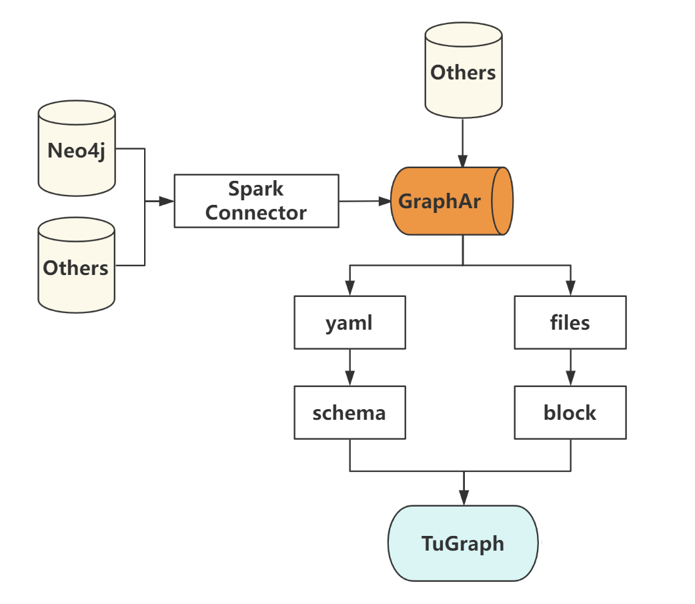

# data-migration



## 利用spark将数据从neo4j导出到GraphAr

### 环境搭建

- 操作系统: `Linux`, 已在`centos7`和`ubuntu20`上进行测试
- 安装`git`, `curl`, `java-11`, `maven`, 配置JAVA_HOME路径, maven配置文件加入mirror镜像

### 软件安装

此处将软件安装在`HOME`路径, 并添加临时环境变量, 具体可根据实际需要调整, 软件版本也可以按需调整

#### spark3.2.4(已有可忽略)

```bash
curl https://mirrors.tuna.tsinghua.edu.cn/apache/spark/spark-3.2.4/spark-3.2.4-bin-hadoop3.2.tgz | tar -xz -C ${HOME}/
export SPARK_HOME="${HOME}/spark-3.2.4-bin-hadoop3.2"  
export PATH="${SPARK_HOME}/bin":"${PATH}"
```

#### neo4j-community-4.4.23(已有可忽略)

```bash
curl https://dist.neo4j.org/neo4j-community-4.4.23-unix.tar.gz | tar -xz -C ${HOME}/
export NEO4J_HOME="${HOME}/neo4j-community-4.4.23"
export PATH="${NEO4J_HOME}/bin":"${PATH}"
```

#### GraphAr spark

```bash
git clone https://github.com/jasinliu/GraphAr.git
cd GraphAr/spark
mvn clean package -DskipTests
```

### 使用说明

1. 参考`GraphAr/spark/import/neo4j.json`编写导出信息, 包含生成gar的配置, neo4j连接的配置, 导出schema的配置，按字段填写

2. `./neo4j.sh neo4j.json`

## GraphAr数据导入tugraph-db

### 导入说明

1. 使用lgraph_import工具, 设置配置文件为gar数据中的XXX.graph.yml, 注意为绝对路径, 设置gar=true即可
2. 示例
   `./lgraph_import -c /root/movie-gar/movie.graph.yml --gar true`

### 注意

1. GraphAr数据中的yml配置文件可以修改, 比如可以在graph.yml中删除指定的vertex或者edge, 也可以在对应的vertex.yml用prefix指定数据路径，数据存储路径可以与配置存储路径分离。
2. GraphAr支持相同的edge_label可以具有不同的properties, 这类数据在tugraph-db中不支持, 导入过程中会报错指出对应edge_label, 可以根据报错信息在GraphAr数据中做修改


## TODO

GraphAr仓库更新importer工具, 支持用户自定义其他数据源的schema导入到GraphAr中, GraphAr仓库换成官方仓库
